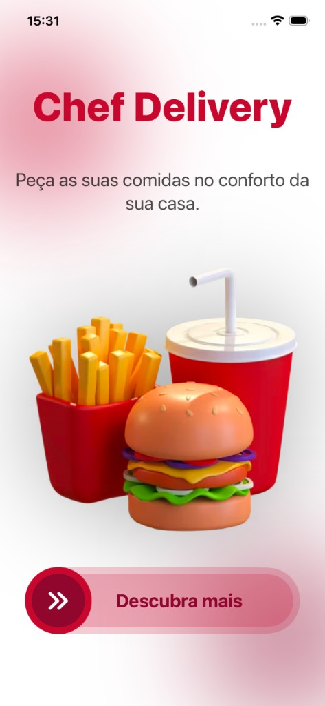
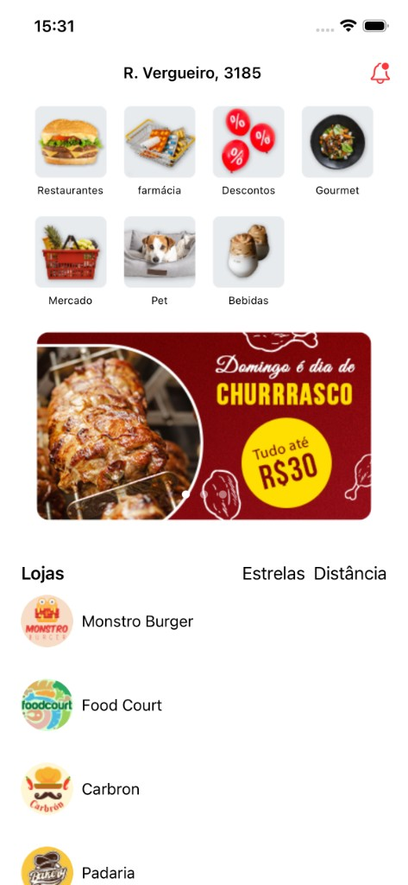
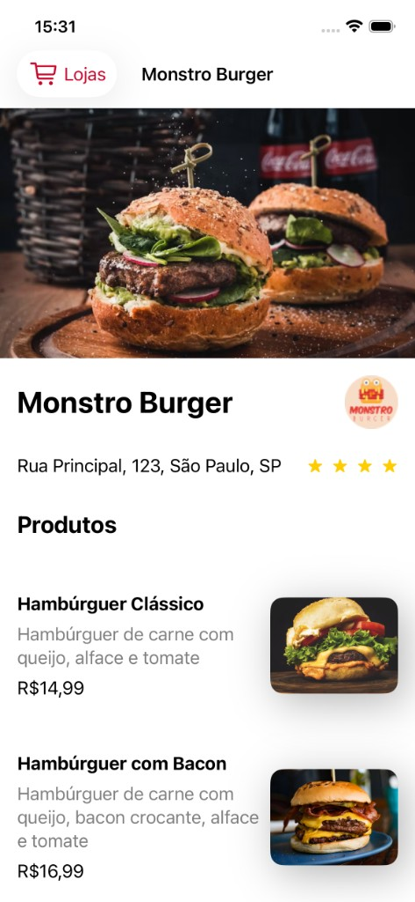
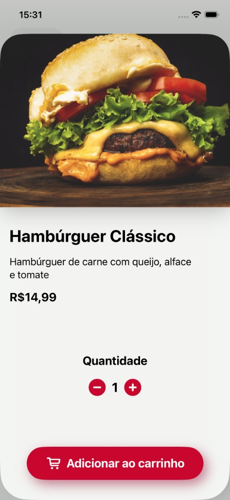

# Chef Delivery

Projeto desenvolvido na formação de iOS da **Alura**, com os cursos:

- [iOS: construindo o seu primeiro app com SwiftUI](https://www.alura.com.br/)
- [iOS com SwiftUI: fazendo requisições HTTP e conexão com API](https://cursos.alura.com.br/course/ios-swiftui-requisicoes-http-conexao-api)

App iOS de delivery de comida construído com **SwiftUI**. Simula a experiência de um app de pedidos: tela de onboarding animada, home com categorias e banners, listagem de lojas com filtros, detalhe da loja e detalhe do produto com seleção de quantidade.

As lojas e o envio do pedido vêm de uma API (Apiary). Categorias e banners ainda usam dados locais.

## Demonstração


[Assistir vídeo completo (`.mov`)](docs/demo.mov)

## Screenshots

| Onboarding | Home |
|:---:|:---:|
|  |  |

| Detalhe da loja | Detalhe do produto |
|:---:|:---:|
|  |  |

## Tecnologias

- Swift / SwiftUI
- Xcode
- URLSession (`async/await`) para GET e POST
- Alamofire (Swift Package Manager)
- JSON com `Codable`, `Decodable`, `Encodable` e `CodingKeys`
- Apiary (mock server / documentação da API)
- Assets locais (imagens e cores no Asset Catalog)

## Como rodar

1. Abra `ChefDelivery.xcodeproj` no Xcode
2. Selecione um simulador ou dispositivo iOS
3. Execute com `Cmd + R`

O Xcode resolve o Alamofire automaticamente via Swift Package Manager. A listagem de lojas e o envio do pedido dependem da API do Apiary.

## Estrutura do projeto

```
ChefDelivery/
├── App/                    # Entrypoint e ContentView (tela principal)
├── HomeView/               # Onboarding com animações e swipe
├── NavigationBar/          # Barra superior (endereço e notificações)
├── GridView/               # Grid de categorias de pedido
├── CarouselView/           # Carrossel de banners promocionais
├── StoriesView/            # Lista de lojas + detalhe da loja
│   └── StoreDetailView/    # Header, produtos e itens da loja
├── ProductView/            # Detalhe do produto, quantidade e envio do pedido
├── Networking/             # HomeService: GET, POST e Alamofire
├── Model/                  # OrderType, StoreType, ProductType e mocks locais
├── Extension/              # Extensão Double para formatação de preço
└── Assets.xcassets/        # Imagens, logos, banners e cores
```

## Funcionalidades atuais

### Onboarding (`HomeView`)
- Animação de entrada (círculos de fundo, título, subtítulo e imagem)
- Imagem arrastável com retorno animado
- Botão “Descubra mais” com gesto de arrastar (slide-to-unlock)
- Transição em tela cheia (`fullScreenCover`) para a home do app

### Home (`ContentView`)
- Navigation bar com endereço e ícone de notificação
- Grid de categorias (Restaurantes, Mercado, Farmácia, Pet, Descontos, Bebidas, Gourmet)
- Carrossel de banners com paginação e troca automática a cada 3 segundos
- Lista de lojas carregada da API
- `ProgressView` enquanto a requisição está em andamento

### Lojas (`StoresContainerView`)
- Filtro por estrelas (1 a 5 ou mais), com opção de limpar
- Filtro por distância (faixas de 5 km), com opção de limpar
- Mensagem “Nenhum resultado encontrado” quando não há resultados
- Cada loja navega para `StoreDetailView` via `NavigationLink`

### Detalhe da loja (`StoreDetailView`)
- Header com imagem, logo, localização e avaliação
- Lista de produtos da loja
- Botão de voltar customizado
- `StoreType` como `ObservableObject`, injetado com `EnvironmentObject`

### Detalhe do produto (`ProductDetailView`)
- Header com imagem, nome, descrição e preço formatado
- Controle de quantidade (aumentar / diminuir)
- Botão “Enviar pedido” faz POST na API
- Alerta de confirmação quando o pedido é enviado
- Apresentação em sheet a partir da loja

## Networking

A camada de rede fica em `HomeService`:

| Método | Verbo | Função |
|--------|-------|--------|
| `fetchData()` | GET | Busca a lista de lojas com `URLSession` e `async/await` |
| `confirmOrder(product:)` | POST | Envia o produto escolhido como JSON |
| `fetchDataWithAlamofire()` | GET | Mesma busca de lojas, usando Alamofire |

A API mockada está no Apiary (`/stores`). Os modelos `StoreType` e `ProductType` decodificam o JSON; `CodingKeys` mapeia `logo_image` e `header_image` para as propriedades em camelCase.

Categorias e banners continuam em `DataSourceMock.swift`.

## Modelos de dados

| Modelo | Descrição |
|--------|-----------|
| `OrderType` | Categorias e itens do carrossel (dados locais) |
| `StoreType` | Loja (nome, distância, logo, header, localização, estrelas, produtos). `Decodable` |
| `ProductType` | Produto (nome, descrição, imagem, preço). `Codable` |

## Extensões

- `Double+`: formatação de preço em Real (`R$`)

## Status do projeto

Implementado até o momento:

- [x] Onboarding animado com slide para entrar no app
- [x] Home com navegação, categorias, carrossel e lojas
- [x] Filtros de lojas (estrelas e distância)
- [x] Detalhe da loja e listagem de produtos
- [x] Detalhe do produto com seleção de quantidade
- [x] Integração com API (GET das lojas e POST do pedido)
- [x] Tela de carregamento durante a busca
- [x] Camada de networking com URLSession e Alamofire
- [ ] Fluxo de carrinho / checkout

## Autor

Patric Pereira — projeto desenvolvido durante os cursos de SwiftUI da Alura.
